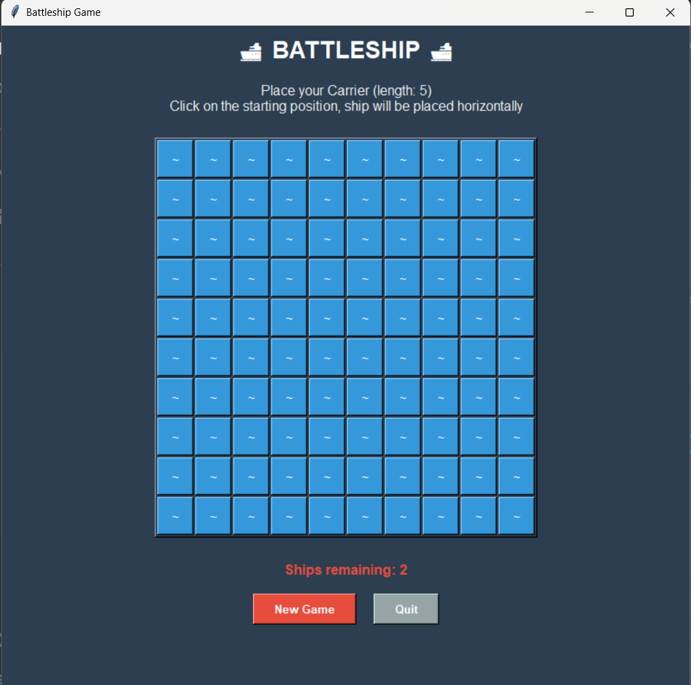

# 🚢 Battleship Game (Python + Tkinter)

A fun and interactive Battleship game built with Python & Tkinter.  
Players place ships on a 10×10 board, then take turns attacking until all ships are sunk.

---

## 🎮 Features

- Interactive 10×10 grid with visual feedback  
- Ship placement phase with validation (horizontal placement only)  
- Attack phase with hit (`X`) / miss (`O`) markers  
- Game status updates (ships remaining, victory message)  
- New Game button to reset the board  

---

## 🖼 Screenshot

  

*(Screenshot of the game window with ships placement / attack phase)*

---

## 🛠 Requirements

- Python 3.8 or newer  
- Tkinter (comes with standard Python)  

---

## 🚀 How to Run

1. Clone the repo:  
   ```bash
   git clone https://github.com/DanielNg0729/BattleshipGame.git
